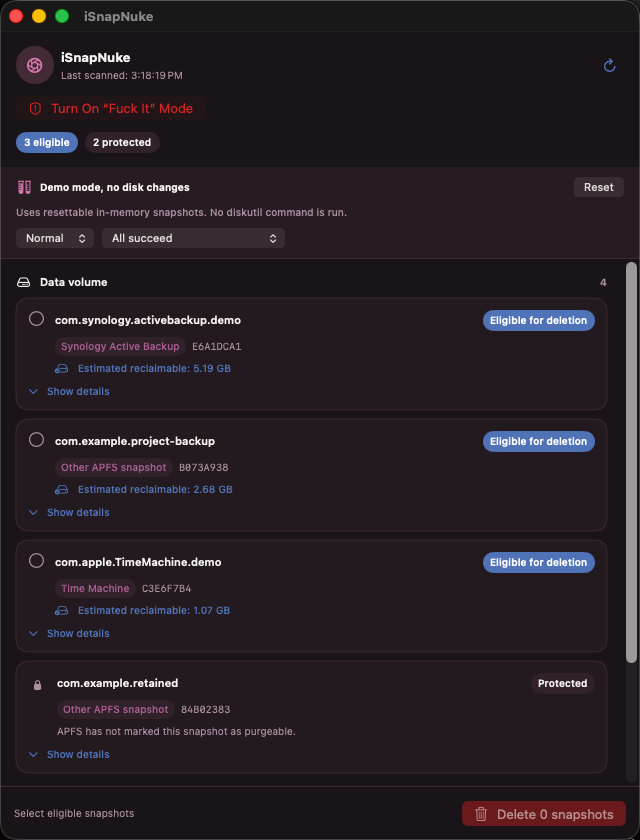
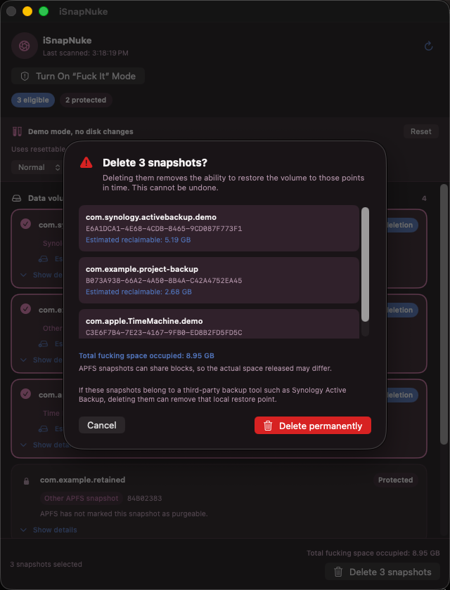
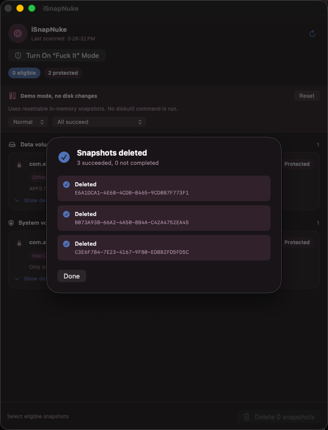

<p align="center">
  
</p>

<h1 align="center">iSnapNuke</h1>

<p align="center">A cautious macOS app for inspecting APFS snapshots and deleting only the snapshots that meet conservative safety rules.</p>

<p align="center"><a href="README.zh-TW.md">繁體中文</a></p>

<p align="center">
  
  
  
</p>

<p align="center">
  <a href="#features">Features</a> · <a href="#why-i-made-this">Why I Made This</a> · <a href="#screenshots">Screenshots</a> · <a href="#safety-rules">Safety Rules</a> · <a href="#fuck-it-mode">Fuck It Mode</a> · <a href="#how-it-works">How It Works</a> · <a href="#installation">Installation</a> · <a href="#updates">Updates</a> · <a href="#build-from-source">Build from Source</a> · <a href="#faq">FAQ</a>
</p>

---

> Deleting an APFS snapshot is irreversible and can remove a system or backup restore point. Read the safety rules before deleting anything.

<a id="about"></a>

## About

iSnapNuke is a local macOS utility for viewing APFS snapshots on the current System and Data volumes. It presents snapshot metadata in a normal macOS window, separates snapshots that meet its conservative deletion rules from protected ones, and requires an explicit confirmation before it runs a deletion command.

The app appears in the Dock, does not install a background service, and does not automatically delete snapshots.

<a id="why-i-made-this"></a>

## Why I Made This

I've always used Synology Active Backup for Business to back up my Mac. But as someone who obsessively watches free disk space, I started noticing it shrink even when I had barely done anything.

A friend gave me DaisyDisk, and one scan revealed a pile of hidden APFS snapshots eating up a surprising amount of space. The most frustrating part was:

- DaisyDisk could see them, but couldn't delete them.
- [Mole](https://github.com/tw93/mole) either didn't find them, or I was using it wrong.
- CleanMyMac X didn't find them at all.

So I built iSnapNuke: a nuclear option for blasting those snapshots away and taking back the disk space that was yours to begin with.

<a id="features"></a>

## Features

- Reads APFS snapshots from the current System and Data volumes.
- Shows each snapshot's name, UUID, XID, source inference, APFS metadata, and APFS Private Size when available.
- Infers known snapshot sources from their names, including macOS Update, Time Machine, and Synology Active Backup.
- Separates snapshots into **Eligible for deletion** and **Protected** groups using conservative safety rules.
- Supports multi-selection, an irreversible-action confirmation dialog, a fresh safety scan before every deletion, progress feedback, and a per-item result summary.
- Attempts standard deletion first and offers an administrator-authorized retry when macOS denies that operation for a likely permission reason.
- Includes a session-only **Fuck It Mode** for deliberately attempting protected snapshots with administrator authorization.
- Supports English and Traditional Chinese interfaces.

<a id="screenshots"></a>

## Screenshots

<p align="center">
  
</p>

<a id="safety-rules"></a>

## Safety Rules

In normal mode, a snapshot can be selected only when all of the following conditions are true:

1. It is on the Data volume.
2. APFS reports `Purgeable` as `Yes`.
3. It is not a `RevertTo` snapshot.
4. It is not a `RootTo` snapshot.
5. Its name does not start with `com.apple.os.update`.
6. Its name and required APFS metadata are present and valid.
7. Its UUID and volume device identifier match the expected formats.

Anything with missing or unknown metadata is protected. A snapshot that meets these rules is still a restore point: deleting it removes the ability to restore that volume to the corresponding point in time.

Time Machine and third-party backup snapshots are identified for visibility, not automatically preserved by name alone. If one meets the normal eligibility rules, deleting it can remove its local restore point. Review every selected snapshot carefully.

> **Estimated reclaimable space:** iSnapNuke uses APFS Private Size as an estimate of the data referenced only by that snapshot. APFS snapshots can share blocks, so deleting one or more snapshots may free a different amount of disk space. If the value cannot be read, the app shows it as unavailable instead of guessing.

<a id="fuck-it-mode"></a>

## Fuck It Mode

Fuck It Mode is off by default, is acknowledged in its own warning dialog, and lasts only for the current app session. It is never saved.

When enabled, it allows selection of any protected snapshot whose UUID and device identifier pass command-input validation. The app then requests macOS administrator authorization and attempts each selected snapshot individually. This includes macOS update snapshots, System volume snapshots, Time Machine snapshots, third-party backup snapshots, and snapshots from unknown sources.

The mode keeps the pre-delete rescan and input-format checks, but bypasses iSnapNuke's protection classification. Deletion cannot be undone, may remove system or backup restore points, and macOS can still reject individual requests. Unlike a normal batch, a force-deletion batch continues after failures and lists every successful, skipped, and failed item.

<a id="how-it-works"></a>

## How It Works

iSnapNuke reads volume and snapshot information with:

```sh
diskutil info -plist /
diskutil info -plist /System/Volumes/Data
diskutil apfs listSnapshots <device> -plist
```

It evaluates the returned APFS metadata against the safety rules above and reads APFS Private Size when the operating system makes it available.

After you select snapshots and confirm the dialog, iSnapNuke scans again and re-evaluates each selected snapshot immediately before deletion. A normal deletion uses:

```sh
diskutil apfs deleteSnapshot <device> -uuid <uuid> -wait
```

If normal deletion fails because of permissions, the result screen can offer a retry that asks macOS for administrator authorization. Fuck It Mode always uses administrator authorization. Normal batches stop at the first failed or skipped snapshot; force-deletion batches continue item by item.

<a id="installation"></a>

## Installation

### System Requirements

- Apple Silicon Mac
- macOS 14 or later

### Prebuilt Releases

Download the Apple Silicon DMG from the [GitHub Releases page](https://github.com/League2EB/iSnapNuke/releases), open it, and drag `iSnapNuke.app` to the Applications shortcut.

Public builds are signed with a Developer ID certificate and notarized by Apple.

<a id="updates"></a>

## Updates

Public DMG builds can check GitHub for signed updates. When an update is available, iSnapNuke offers installation; if the installed version is no longer supported, it prompts you to update before using the app.

<a id="build-from-source"></a>

## Build from Source

Run these commands from a local checkout of the project:

```sh
swift test
./scripts/build-app.sh
open dist/iSnapNuke.app
```

`build-app.sh` builds a Release app bundle at `dist/iSnapNuke.app`, generates the `.icns` app icon from `Assets/AppIcon/iSnapNuke.jpg`, and ad-hoc signs the bundle for local use.

Building from source requires the Xcode Command Line Tools.

Default source builds do not include the public update keys, so in-app updates are disabled. To update this build, pull a newer source revision and build it again.

If Gatekeeper blocks the first launch, Control-click the app in Finder and choose **Open**. Closing the main window quits the app.

<a id="language-support"></a>

## Language Support

- Traditional Chinese is used when the preferred system language is `zh-Hant`, `zh-TW`, `zh-HK`, or `zh-MO`.
- English is the default and fallback for every other system language, including Simplified Chinese and Japanese.

<a id="faq"></a>

## FAQ

### Does iSnapNuke modify macOS or delete snapshots automatically?

No. It reads APFS metadata locally and runs a deletion command only after you explicitly select snapshots and confirm the irreversible-action dialog. It does not modify macOS system files or snapshot contents.

### Why is a snapshot protected?

It may be on the System volume, not marked purgeable, a current revert or root snapshot, a macOS update snapshot, or have incomplete or invalid metadata. Missing information is treated as unsafe.

### What happens if macOS denies deletion?

The normal result screen identifies the failure. For likely permission failures, it can offer a retry that asks macOS for administrator authorization. A failed normal batch stops at that item so you can review the result.

### Can I delete Time Machine or Synology Active Backup snapshots?

Their names are shown as source inferences, but normal eligibility is based on APFS metadata and the safety rules. Deleting an eligible backup snapshot can still remove a local restore point. Fuck It Mode can attempt protected backup snapshots as well, at considerably greater risk.

### Does APFS Private Size equal the space I will recover?

Not exactly. It measures data referenced only by a snapshot and is a useful estimate, but snapshots can share APFS blocks. The final amount of freed disk space can be higher or lower.

<a id="privacy"></a>

## Privacy

iSnapNuke operates locally. It does not install a background service, collect telemetry, or upload snapshot data. Snapshot operations have no network communication. Public DMG builds connect to GitHub over HTTPS only to check for signed updates and, after you choose to install one, to download it. Default source builds do not enable in-app updates.

<a id="license"></a>

## License

This project is licensed under the [MIT License](LICENSE).
